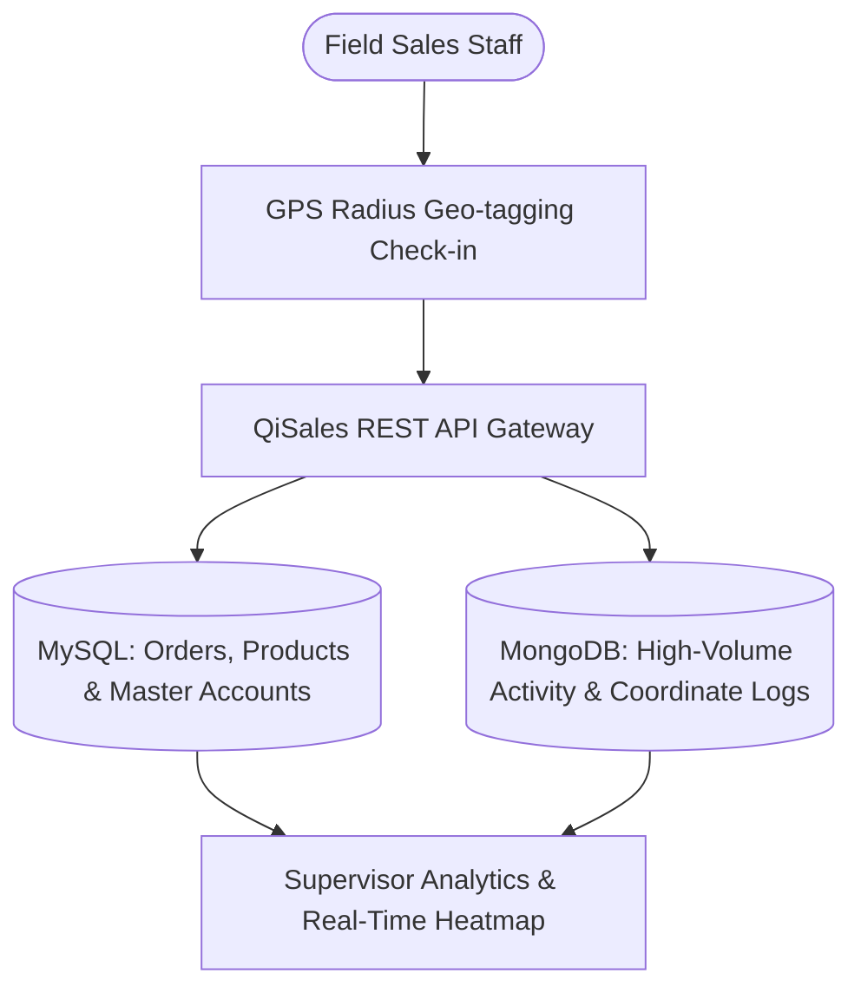

# QiSales Backend — Sales Force Automation & MongoDB Tracking API

## 📌 Ringkasan Eksekutif & Identitas Proyek
- **Perusahaan / Organisasi:** PT Qira Teknologi Indonesia
- **Peran & Tanggung Jawab:** Backend Engineer
- **Tipe Sistem:** Sales Force Automation (SFA) & Field Tracking API

---

## 🎯 Latar Belakang & Masalah (Problem Statement)
Perusahaan distribusi membutuhkan tracking lokasi sales lapangan, pencatatan kunjungan outlet, dan rekap order harian dengan histori log yang sangat besar.

## 💡 Solusi & Nilai Bisnis (Solution & Business Value)
Membangun backend API Laravel yang memadukan database relasional MySQL (master data sales/produk) dengan database NoSQL MongoDB (`jenssegers/mongodb`) untuk menyimpan jutaan log geo-koordinat check-in sales.

---

## 🛠️ Tech Stack & Arsitektur Lengkap

### 📦 Versi Framework & Runtime Utama (Core Technology Versions)
| Komponen / Framework | Versi Spesifik | Keterangan & Peran Arsitektural |
| :--- | :--- | :--- |
| **Laravel Framework** | `v6.18.35 LTS` | Sales Force Automation (SFA) Gateway |
| **PHP Runtime** | `v7.3 / v7.4+` | GPS Geo-Radius Validation Algorithms |
| **MongoDB Database** | `jenssegers/mongodb v3.6.x` | High-Volume Field Check-in & Coordinate Logs (NoSQL) |
| **MySQL Database** | `v5.7 / v8.0` | Master Retail Outlets & User Transaction DB (RDBMS) |

### 🏛️ Diagram Alur Arsitektur Sistem (System Architecture)

| Layer / Domain | Teknologi / Library | Keterangan Arsitektural |
| :--- | :--- | :--- |
| **Framework & APIs** | `Laravel, PHP, RESTful APIs` | Implementasi arsitektural |
| **NoSQL Database** | `MongoDB (`jenssegers/mongodb`) for high-volume check-in logs` | Implementasi arsitektural |
| **Relational DB** | `MySQL for transactions & user accounts` | Implementasi arsitektural |
| **Geo Data** | `AzisHapidin IndoRegion, Google Maps Coordinates` | Implementasi arsitektural |
| **Mobile Push** | `Brozot Laravel FCM, ConsoleTVs Charts` | Implementasi arsitektural |

---

## 🚀 Fitur-Fitur Kunci & Rekayasa Teknis
- **Geo-Tagging Check-in:** Verifikasi radius lokasi GPS sales saat melakukan kunjungan ke outlet toko.
- **MongoDB Activity Logging:** Penyimpanan data koordinat dan foto bukti kunjungan sales ke MongoDB.
- **Real-time Sales Leaderboard:** Analitik pencapaian target penjualan harian dan rute kunjungan sales.

---

## 📈 Metrik, Dampak & Hasil Terukur (Google XYZ Formula)
- **Penyimpanan jutaan log tracking lokasi sales tanpa degradasi performa database operasional.**
- **Peningkatan efisiensi rute dan akurasi kunjungan sales lapangan sebesar 30%.**

---

## 🌟 Poin Resume Siap Pakai (Resume Ready Bullets)
* *Architected Sales Force Automation (SFA) backend combining MySQL with MongoDB for scalable geo-tracking logs.*
* *Engineered GPS radius validation APIs verifying field sales check-ins at registered retail outlets.*
* *Integrated Firebase Cloud Messaging for instant route assignments and sales target push notifications.*