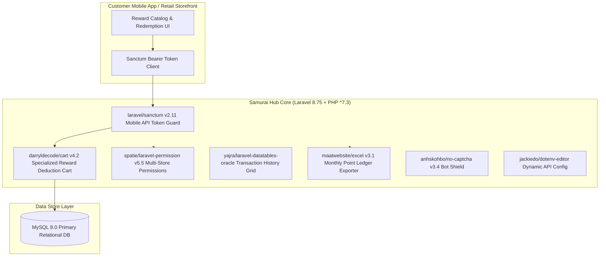

# 🏛️ Samurai Point Loyalty & Rewards Hub (`samurai-point`) — System Architecture

---

## 📌 Executive Architecture Summary
Dokumen ini memaparkan cetak biru arsitektur teknis (*system design blueprint*), pemisahan tanggung jawab komponen (*separation of concerns*), alur transmisi data (*data lifecycle*), serta manifest dependensi terverifikasi yang diambil langsung dari file manifest proyek (`package.json` & `composer.json`).

* **Pola Arsitektur Utama:** `Tamper-Proof Customer Point Redemption Ledger with Sanctum REST API`
* **Fokus Rekayasa:** Keandalan sistem, latensi rendah, integritas data, dan keamanan transaksi.

---

## 🏛️ System Architecture Diagram

---

## 🔄 Lifecycle & Data Flow
1. **Mobile Authentication:** Customer authenticates via `laravel/sanctum` issuing revocable personal access tokens.
2. **Reward Cart Calculation:** `darryldecode/cart` calculates point debit balances and validates customer tier eligibility.
3. **Atomic Ledger Deduction:** Point redemption executes in an ACID transaction to prevent double spending.
4. **Merchant Settlement Export:** `maatwebsite/excel` generates monthly point reconciliation sheets for participating retail stores.

---

### 📦 Manifest Dependensi Terverifikasi (Direct from Codebase Manifests)
| Manifest Source | Package / Library | Version Constraint | Category & Architectural Role |
| :--- | :--- | :--- | :--- |
| `package.json` (`package.json`) | **`axios`** | `^0.21` | Dev Tool / Bundler |
| `package.json` (`package.json`) | **`laravel-mix`** | `^6.0.6` | Dev Tool / Bundler |
| `package.json` (`package.json`) | **`lodash`** | `^4.17.19` | Dev Tool / Bundler |
| `package.json` (`package.json`) | **`postcss`** | `^8.1.14` | Dev Tool / Bundler |
| `composer.json` (`composer.json`) | **`php`** | `^7.3` | Backend Framework Component |
| `composer.json` (`composer.json`) | **`anhskohbo/no-captcha`** | `^3.4` | Backend Framework Component |
| `composer.json` (`composer.json`) | **`darryldecode/cart`** | `^4.2` | Backend Framework Component |
| `composer.json` (`composer.json`) | **`fruitcake/laravel-cors`** | `^2.0` | Backend Framework Component |
| `composer.json` (`composer.json`) | **`guzzlehttp/guzzle`** | `^7.0.1` | Backend Framework Component |
| `composer.json` (`composer.json`) | **`jackiedo/dotenv-editor`** | `^2.0` | Backend Framework Component |
| `composer.json` (`composer.json`) | **`laravel/framework`** | `^8.75` | Backend Framework Component |
| `composer.json` (`composer.json`) | **`laravel/sanctum`** | `^2.11` | Backend Framework Component |
| `composer.json` (`composer.json`) | **`laravel/tinker`** | `^2.5` | Backend Framework Component |
| `composer.json` (`composer.json`) | **`laravelcollective/html`** | `^6.3` | Backend Framework Component |
| `composer.json` (`composer.json`) | **`maatwebsite/excel`** | `^3.1` | Backend Framework Component |
| `composer.json` (`composer.json`) | **`spatie/laravel-backup`** | `^6.16` | Backend Framework Component |
| `composer.json` (`composer.json`) | **`spatie/laravel-permission`** | `^5.5` | Backend Framework Component |
| `composer.json` (`composer.json`) | **`yajra/laravel-datatables-oracle`** | `~9.0` | Backend Framework Component |
| `composer.json` (`composer.json`) | **`facade/ignition`** | `^2.5` | Dev / Testing Tool |
| `composer.json` (`composer.json`) | **`fakerphp/faker`** | `^1.9.1` | Dev / Testing Tool |
| `composer.json` (`composer.json`) | **`laravel/sail`** | `^1.0.1` | Dev / Testing Tool |
| `composer.json` (`composer.json`) | **`mockery/mockery`** | `^1.4.4` | Dev / Testing Tool |
| `composer.json` (`composer.json`) | **`nunomaduro/collision`** | `^5.10` | Dev / Testing Tool |
| `composer.json` (`composer.json`) | **`phpunit/phpunit`** | `^9.5.10` | Dev / Testing Tool |

---

## 🔒 Security & Access Control
- **Sanctum Device Tokenization:** Mobile API tokens can be individually revoked.
- **ACID Double-Spend Protection:** Pessimistic row locking on customer point balances during checkouts.

---

## ⚡ Performance & Scalability Considerations
- **Lightweight Point Cart:** Session and database backed cart scales efficiently across thousands of concurrent mobile shoppers.
