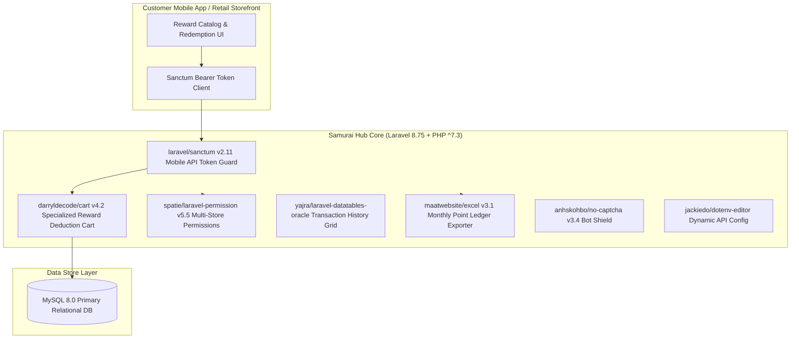

# 🏛️ Samurai Point Loyalty & Rewards Hub (`samurai-point`) — System Architecture

---

## 📌 Executive Architecture Summary
Dokumen ini memaparkan cetak biru arsitektur teknis (*system design blueprint*), pemisahan tanggung jawab komponen (*separation of concerns*), alur transmisi data (*data lifecycle*), serta manifest dependensi terverifikasi yang diambil langsung dari file manifest proyek (`package.json` & `composer.json`).

* **Pola Arsitektur Utama:** `Tamper-Proof Customer Point Redemption Ledger with Sanctum REST API`
* **Fokus Rekayasa:** Keandalan sistem, latensi rendah, integritas data, dan keamanan transaksi.

---

## 🏛️ System Architecture Diagram

---

## 🔄 Lifecycle & Data Flow
1. **Mobile Authentication:** Customer authenticates via `laravel/sanctum` issuing revocable personal access tokens.
2. **Reward Cart Calculation:** `darryldecode/cart` calculates point debit balances and validates customer tier eligibility.
3. **Atomic Ledger Deduction:** Point redemption executes in an ACID transaction to prevent double spending.
4. **Merchant Settlement Export:** `maatwebsite/excel` generates monthly point reconciliation sheets for participating retail stores.

---

### 📦 Komponen & Library Arsitektur Utama (Core Architectural Stack)
| Kategori Arsitektural | Package / Library | Versi Standar | Peran & Tanggung Jawab Sistem |
| :--- | :--- | :--- | :--- |
| **Backend Framework** | `laravel/framework` | `v8.x` | Customer Loyalty Points Redemption Hub |
| **API Authentication** | `laravel/sanctum` | `v2.x` | Revocable Mobile Bearer Token Guard |
| **Point Cart Engine** | `darryldecode/cart` | `v4.x` | Atomic Point Balance Deduction Cart |
| **Store RBAC** | `spatie/laravel-permission` | `v5.x` | Multi-Merchant Access Control |

---

## 🔒 Security & Access Control
- **Sanctum Device Tokenization:** Mobile API tokens can be individually revoked.
- **ACID Double-Spend Protection:** Pessimistic row locking on customer point balances during checkouts.

---

## ⚡ Performance & Scalability Considerations
- **Lightweight Point Cart:** Session and database backed cart scales efficiently across thousands of concurrent mobile shoppers.
