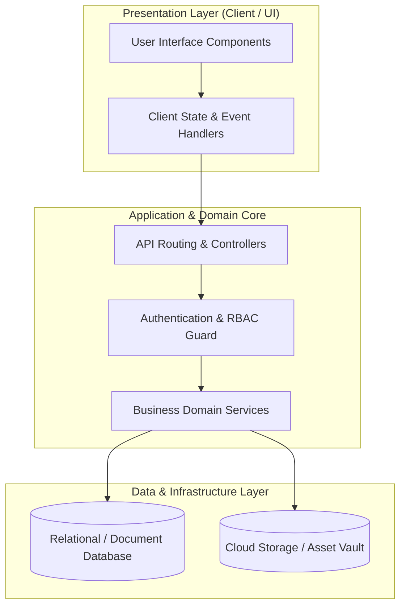

# 🏛️ [Nama Proyek] — System Architecture & Design Blueprint

---

## 📌 Executive Architecture Summary
Dokumen ini memaparkan cetak biru arsitektur teknis (*system design blueprint*), pemisahan tanggung jawab komponen (*separation of concerns*), alur transmisi data (*data lifecycle*), serta pertimbangan keamanan dan skalabilitas untuk subproyek ini.

---

## 🏛️ System Architecture Diagram

---

## 🔄 Lifecycle & Data Flow
1. **Request Ingestion:** Klien mengirimkan request terotentikasi melalui antarmuka pengguna ke endpoint API.
2. **Validation & Authorization:** Middleware memvalidasi integritas payload, sanitasi input, dan otorisasi hak akses peran pengguna.
3. **Domain Processing:** Service layer mengeksekusi logika bisnis dan manajemen status sistem.
4. **Persistence & Response:** Data transaksi disimpan ke database penyimpanan utama, dan status respons dikembalikan ke klien.

---

## 🔒 Security & Access Control
* **Authentication & Session:** Token-based authentication (JWT / Bearer) dengan mekanisme rotasi token.
* **Input Sanitization:** Validasi ketat terhadap SQL Injection, XSS, dan CSRF.

---

## ⚡ Performance & Scalability Considerations
* **Caching Strategy:** Pemanfaatan caching query untuk meminimalkan beban database.
* **Optimistic Updates:** Immediate feedback pada antarmuka pengguna saat melakukan aksi mutasi data.
