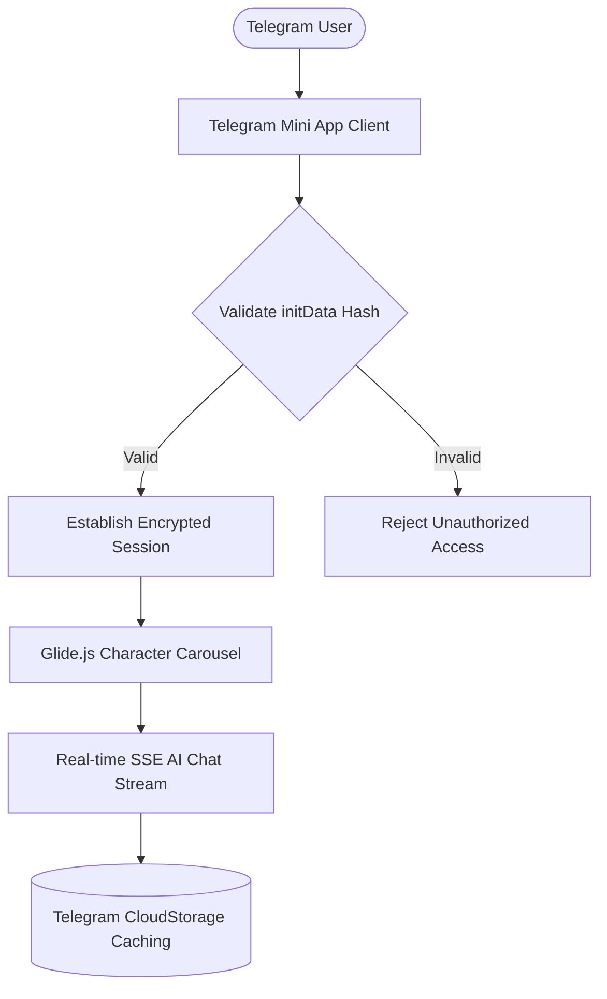

# KIP Telegram AI Girlfriend — Telegram Mini App (TMA)

## 📌 Ringkasan Eksekutif & Identitas Proyek
- **Perusahaan / Organisasi:** Kipley Pte. Ltd. (Singapore / Remote)
- **Peran & Tanggung Jawab:** Frontend Web3 & Mini App Engineer
- **Tipe Sistem:** Telegram Mini App (TMA), AI Chatbot & Virtual Companion

---

## 🎯 Latar Belakang & Masalah (Problem Statement)
Membawa pengalaman interaksi AI virtual companion langsung ke dalam jutaan pengguna Telegram dengan integrasi wallet dan pembayaran on-chain.

## 💡 Solusi & Nilai Bisnis (Solution & Business Value)
Membangun Telegram Mini App berbasis Next.js dan `@telegram-apps/sdk-react` dengan UI fluid Chakra UI, integrasi AI streaming, dan animasi carousel.

---

## 🛠️ Tech Stack & Arsitektur Lengkap

### 🏛️ Diagram Alur Arsitektur Sistem (System Architecture)

| Layer / Domain | Teknologi / Library | Keterangan Arsitektural |
| :--- | :--- | :--- |
| **Core Framework** | `Next.js App Router, React 18, TypeScript` | Implementasi arsitektural |
| **Telegram SDK** | `@telegram-apps/sdk-react, @telegram-apps/telegram-ui` | Implementasi arsitektural |
| **UI & Styling** | `Chakra UI, Emotion Styled, Glide.js Carousel` | Implementasi arsitektural |
| **State & Data** | `TanStack Query, Axios, Microsoft Fetch Event Source` | Implementasi arsitektural |
| **AI Streaming** | `Server-Sent Events (SSE) for conversational AI` | Implementasi arsitektural |

---

## 🚀 Fitur-Fitur Kunci & Rekayasa Teknis
- **Telegram Native Experience:** Integrasi haptic feedback, back button, tema dinamis sesuai client Telegram pengguna.
- **Real-time AI Chat:** Streaming percakapan interaktif dengan latensi sub-detik.
- **Persona Carousel:** Pemilihan karakter AI interaktif menggunakan Glide.js.
- **In-App Token & Subscription:** Alur top-up token percakapan di dalam Telegram.

---

## 📈 Metrik, Dampak & Hasil Terukur (Google XYZ Formula)
- **Respons AI streaming < 400ms pertama token output.**
- **Mendukung ribuan sesi percakapan harian aktif langsung dari chat Telegram.**

---

## 🌟 Poin Resume Siap Pakai (Resume Ready Bullets)
* *Engineered high-engagement Telegram Mini App (TMA) using Next.js, @telegram-apps/sdk-react, and Chakra UI.*
* *Integrated real-time streaming LLM responses via Server-Sent Events within the Telegram WebView.*
* *Implemented native Telegram features including haptic feedback, CloudStorage caching, and theme auto-detection.*