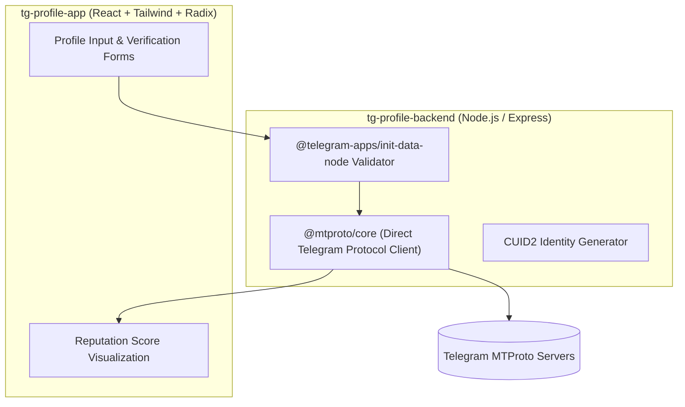

# RethinkableXYZ — Telegram Reputation Protocol & MTProto Profiling

## 📌 Ringkasan Eksekutif & Identitas Proyek
- **Perusahaan / Organisasi:** Kipley Pte. Ltd. (Singapore / Remote)
- **Peran & Tanggung Jawab:** Full Stack Engineer (Telegram & MTProto Protocol)
- **Tipe Sistem:** Telegram Profiling App & Identity Protocol

---

## 🎯 Latar Belakang & Masalah (Problem Statement)
Memvalidasi reputasi, aktivitas, dan kredensial pengguna Telegram secara terdesentralisasi untuk mencegah akun bot dan spam.

## 💡 Solusi & Nilai Bisnis (Solution & Business Value)
Membangun sistem 2-tier: `tg-profile-app` (Frontend React/Tailwind/Radix) dan `tg-profile-backend` (Node.js/Express) yang mengintegrasikan protokol `@mtproto/core` Telegram untuk verifikasi signature dan deep profiling data.

---

## 🛠️ Tech Stack & Arsitektur Lengkap

### 🏛️ Diagram Alur Arsitektur Sistem (System Architecture)

| Layer / Domain | Teknologi / Library | Keterangan Arsitektural |
| :--- | :--- | :--- |
| **Frontend App** | `React.js, TypeScript, Tailwind CSS, Radix UI Primitives, React Hook Form` | Implementasi arsitektural |
| **Backend API** | `Node.js, Express, @mtproto/core (MTProto API client)` | Implementasi arsitektural |
| **Telegram Security** | `@telegram-apps/init-data-node, CUID2, Cheerio` | Implementasi arsitektural |
| **Data Layer** | `Axios, Date-fns, Dotenv` | Implementasi arsitektural |

---

## 🚀 Fitur-Fitur Kunci & Rekayasa Teknis
- **MTProto Protocol Integration:** Mengakses API level protokol Telegram untuk verifikasi kredensial akun.
- **Telegram Reputation Scoring:** Algoritma scoring otomatis berdasarkan histori dan aktivitas Telegram.
- **Accessible UI:** Antarmuka responsif menggunakan Radix UI primitives dan Tailwind CSS.

---

## 📈 Metrik, Dampak & Hasil Terukur (Google XYZ Formula)
- **Verifikasi identitas dan skor reputasi akun Telegram dalam waktu < 2 detik.**
- **Mampu memproses profiling ratusan akun Telegram secara simultan.**

---

## 🌟 Poin Resume Siap Pakai (Resume Ready Bullets)
* *Developed Telegram identity verification platform integrating native MTProto protocol (@mtproto/core).*
* *Architected Node.js backend to securely validate Telegram initData hashes and parse profile metadata.*
* *Built accessible, accessible frontend with React, TypeScript, Tailwind CSS, and Radix UI components.*